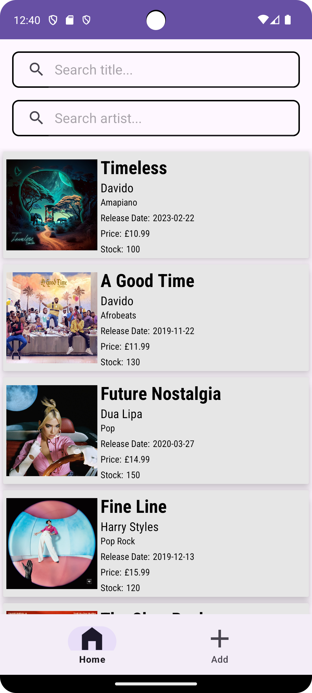
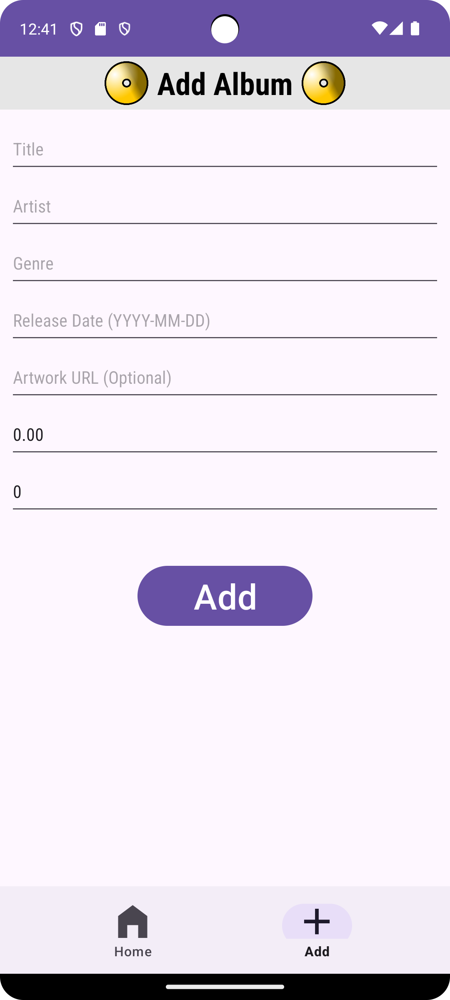
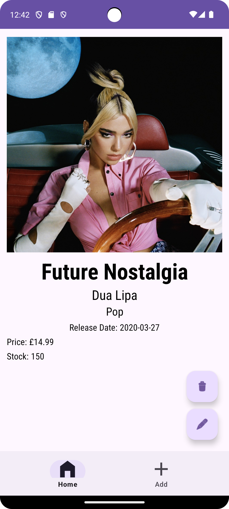
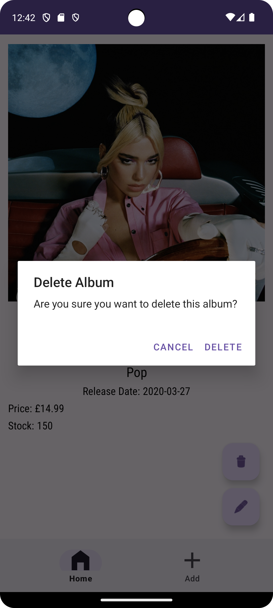
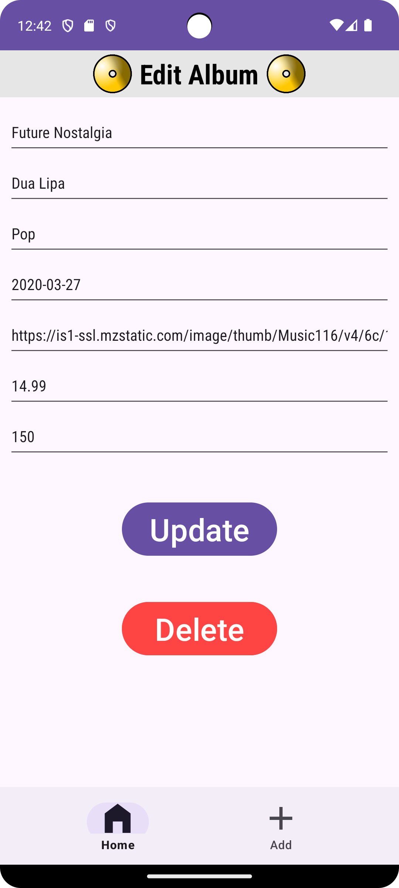
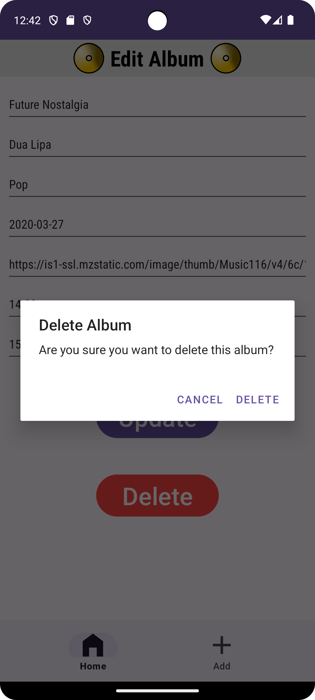

# Record Shop - Android Frontend - Java 🎵
A modern and user-friendly record shop Android application built with XML and Android Views for the frontend and Spring Boot for the backend.
## Overview
This application provides a digital platform for browsing, searching, and managing a record shop inventory. The app features a clean, intuitive interface designed with XML and Android Views..
## Features ✨
- Full integration with [Record Shop Backend API](https://github.com/tchabva/recordshopbackend)
- Browse record catalogue with cover art and details
- Search functionality with instant results
- Responsive UI for different screen sizes
- Smooth animations and transitions

%%
TO DO ADD SCREENSHOTS
%%

## Screenshots
<table>
  <tr>
    <td></td>
    <td></td>
    <td></td>
    <td></td>
    <td></td>
    <td></td>
  </tr>
</table>


## Tech Stack 🛠️
### Frontend:
- Java
- XML and Android Views
- MVVM Architecture
- Material Design Components
- Networking: Retrofit
- Image Loading: Glide
- Navigation: Fragment Navigation
### Backend:
The application requires the backend service to function properly:
- [Record Shop Backend](https://github.com/tchabva/recordshopbackend)
- Built with Spring Boot using Java
- RESTful API design
- Postgres Database Integration
## Getting Started
### Prerequisites ⚙️
1. Android Studio Flamingo or newer
2. JDK 11+
3. An Android device running API 21 (Lollipop) or higher
4. Backend server running (see setup instructions below)
### Installation
1. Clone the repository:
    ```bash
    git clone https://github.com/tchabva/Recordshop-Frontend-Compose.git
    ```
2. Open the project in Android Studio and let Gradle sync the project.
3. Set up the backend server. Follow the README:
    - Clone and run the [Record Shop Backend](https://github.com/tchabva/recordshopbackend)
4. Update the API Base URL in the frontend - if required
5. Build & run the application on your device or emulator
### Configuration
The app is configured to connect to the backend service. You may need to adjust the backend URL in the app's configuration based on your setup environment.